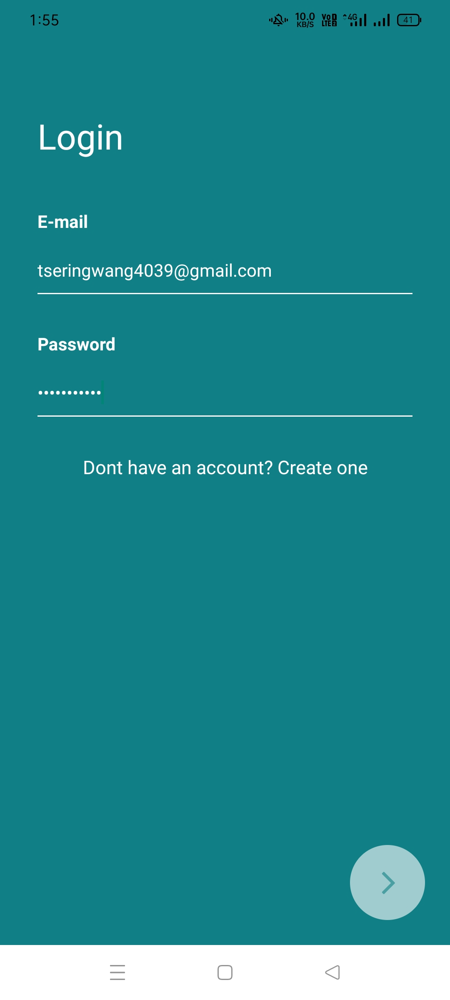
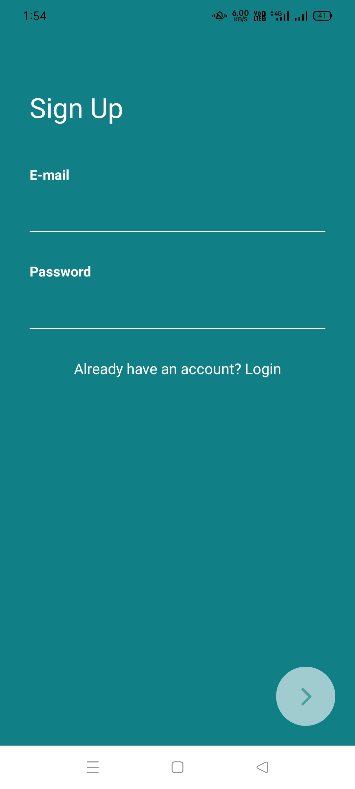
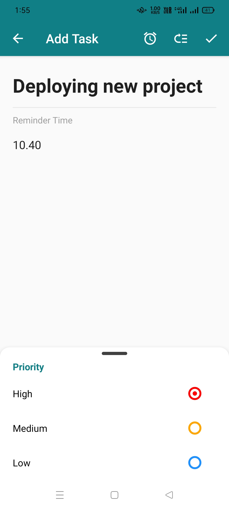
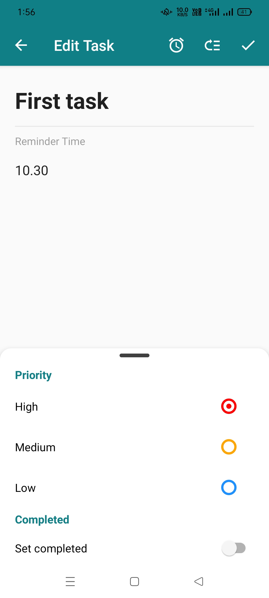
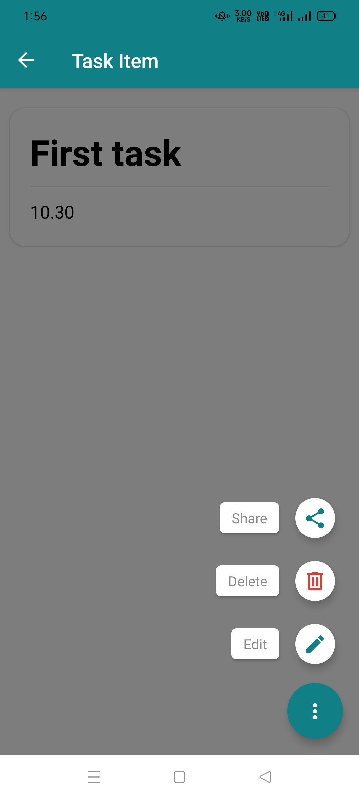

Project Created By : Tsering Wangchu and Vidiyala Sai Akshara Sreeja 

Title: Task Manager App using React-Native 

Table of Contents
-->Introduction
-->Features
-->Screenshots
-->Getting Started
-->Prerequisites
-->Installation
-->Usage
-->Technologies Used
-->Contributing
-->License

Introduction

The Task Manager App is a mobile application built using React Native that allows users to manage their tasks and to-do lists efficiently. It provides a user-friendly interface for creating, editing, and tracking tasks, making it easy to stay organized and productive.

Features

* Create, edit, and delete tasks.
* Categorize tasks into different lists or categories.
* Set due dates and priorities for tasks.
* Mark tasks as completed.
* View and filter tasks by category, priority, and completion status.
* User authentication and task synchronization across devices (if implemented).

Screenshots

Getting Started

Prerequisites

Before you begin, ensure you have the following prerequisites:

->Node.js installed
->npm or Yarn package manager
->React Native CLI installed

Installation

1) Clone the repository:

 git clone https://github.com/tsering651/TaskManagerApplication.git

2) Navigate to the project directory:

  cd TaskManagarApp

3) Install project dependencies:

      npm install

4) Run the app on an emulator or physical device:

    npx react-native run-android
        or
    expo start

 Usage   

 ->Open the Task Manager App on your mobile device.
 ->Create tasks and categorize them.
 ->Set due dates and priorities for tasks.
 ->Mark tasks as completed when done.
 ->Explore filtering options to manage your tasks efficiently.  

 Technologies Used

1)React Native
2)JavaScript/TypeScript
3)React Navigation
4)Redux (or other state management tools)
5)AsyncStorage or a backend for data storage (if implemented)
6)Firebase for authentication

License

This project is licensed under the MIT License.
Feel free to customize this README according to your project's specific details and structure. Don't forget to update the links and placeholders with actual information from your project.